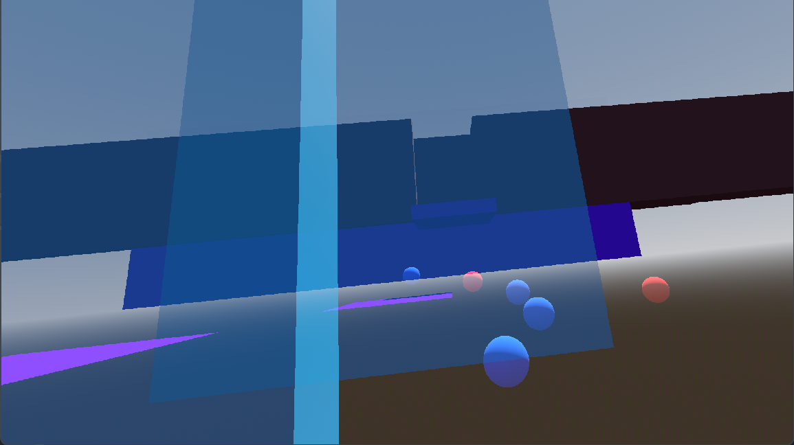
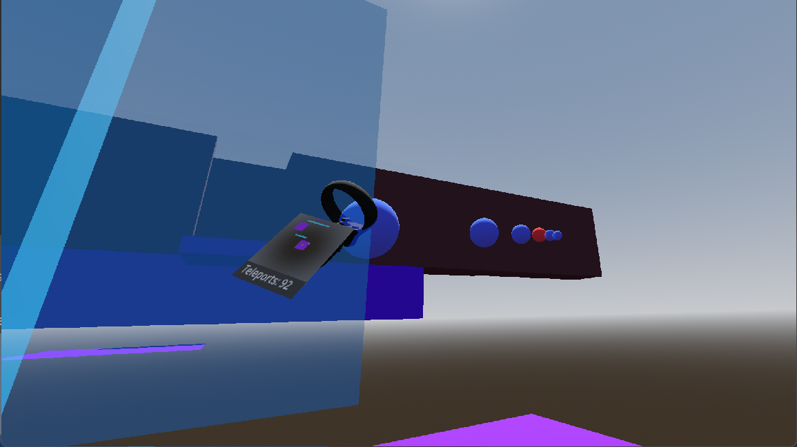
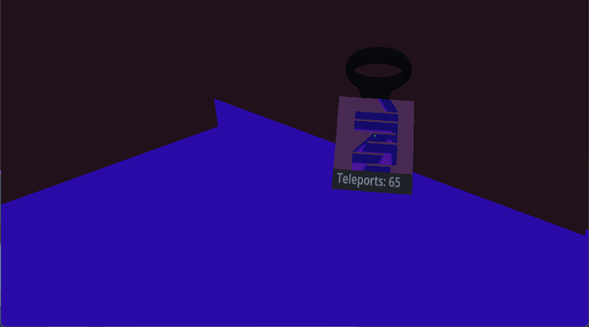
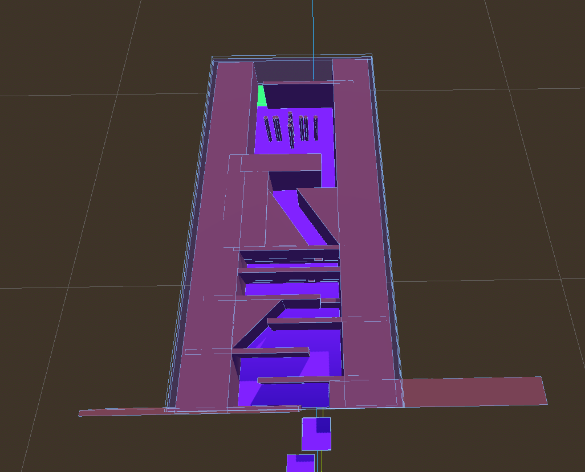

# Final Project
- Andrew Hoyle (hoyle020)
- Robert Hairston (hairs016)

## Premise
The final project we have presented here is an interactive, locomotion-based VR experience. This locomotion is performed by a teleportation pointer that can be flexed by the user. Further, this pointer can be extended if more length is required to teleport a distance. Our idea for this project is based on the paper from **Alex Olwal** and **Steven Feiner** referenced [here](https://uist.acm.org/archive/adjunct/2003/pdf/posters/p17-olwal.pdf) at Columbia University. Some modifications in the pointer that deviate from the one described in the pointer will be explained, and further additions will be included in our description.

## Design

### Flexing Manipulation
In the paper, they perform flexing between two controllers, utilizing a quadratic Bézier function to produce their respected flexed pointer. Instead, in our implementation, the pointer is flexed between the user's controller (*point_zero*), the user-manipulated *point_one*, and the sentimental position, which we mark as *point_two*. Similarly, we use a quadratic Bézier function to produce the points between these 3 points, supplying different *t* timestamps to the function. Determining the incrementation between *t* timestamps is computed by a bisection, which we go into greater detail about later. The idea behind this approach is that the user has more visible control over the flexing aspect of the pointer since *point_one* and *point_two* can be more freely controlled. Thus allowing for more drags to increase accuracy in flexing.

### Extension
Our current implementation supports extension of the pointer in the given direction that it is pointing. This is done by computing a direction vector between *pn* where [*point_one, p0, ..., pn, point_two*] and *point_two*. Thus allowing us to easily expand the direction the pointer is being flexed in. We can dynamically supply more spheres as the pointer expands allowing the user to maintain decent visibility on the length of the pointer. Similarly the rate at which pointers appear is determined by bisection.

### Map & Limited Teleportations
In order to best utilize and showcase our pointer, we decided to supply the user with a visible map. This map provides vision and allows them to circumvent difficult obstacles in less time with the flexible pointer. Further, to showcase the utility of the pointer, the user is limited in how many teleports they can perform. This is done to show how the flexibility of the pointer provides the user with an efficient traversing mechanism.

### Obstacle Course
Our obstacle is specifically geared to be completed optimally with the flexible pointer. It is set up to be a succinct display of the pointer's capabilities, with each challenge asking the user to utilize the pointer in a new way. We start with three platforms floating in space, with the idea that the user can use these to start getting used to working with the pointer’s ability to extend, retract and bend. Once the user has started in the actual maze, then the real challenges begin. The first challenges are relatively simple, the user only has to do a slalom using the flexing ability of the pointer to do so in as few teleports as possible. Then, the user encounters a narrow crack in the walls which they have to maneuver the pointer with sufficient dexterity to slip through, hopefully getting close enough to the next challenge that they don’t have to waste further teleports getting even closer. That next challenge is a “jump” where the user has to use the pointer to get over a high wall, this tests the user’s ability to use the pointer’s verticality. Following that, the user is tested for a slightly different type of dexterity with two relatively narrow and offset holes in two different walls, and the user can hopefully get through both of these at once. The next task is for the user to go down a relatively long hallway with a bend at the end, this tests the user’s ability to manipulate the pointer at long distances. Finally, the last test tests the user's speed and reflexes by asking them to move through a bunch of moving obstacles. Those who make it to the end will receive a reward, if you can do it in a low enough number of teleports.

## Function Documentation

## Attributions
[1]A. Olwal and S. Feiner, “The Flexible Pointer: An Interaction Technique for Selection in Augmented and Virtual Reality,” in ACM Symposium on User Interface Software and Technology, 2003. Accessed: Dec. 21, 2023. [Online]. Available: https://uist.acm.org/archive/adjunct/2003/pdf/posters/p17-olwal.pdf

Sound files sourced from Pixabay: [Medieval Fanfare](https://pixabay.com/sound-effects/medieval-fanfare-6826/) [Error Sound](https://pixabay.com/sound-effects/error-sound-39539/)